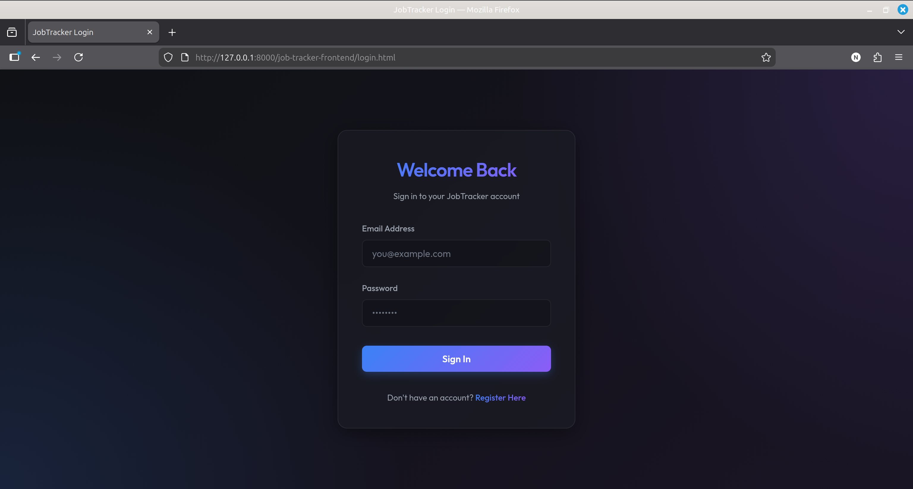
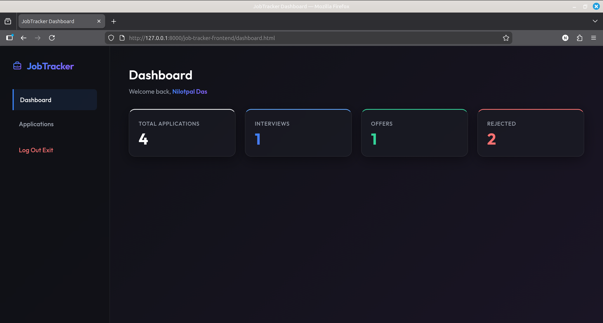
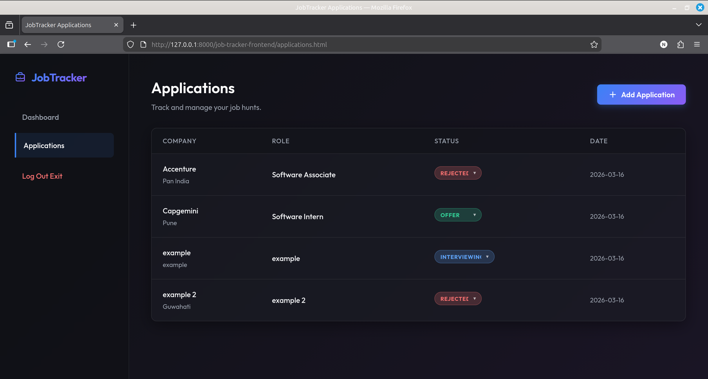

<div align="center">
  <h1>🎯 Job Application Tracker</h1>
  <p>A full-stack application to track and manage job applications effectively.</p>

  <!-- Badges -->
  <p>
    
    
    
    
    
    
  </p>
</div>

---

## 📖 Overview

The **Job Tracker** is a comprehensive, full-stack solution designed to help job seekers organize, monitor, and streamline their job application process. 

It features a robust **Spring Boot** backend for secure data management, RESTful APIs, and database interactions, paired with a functional frontend interface built with standard HTML/CSS/JS to interact with the backend services.

---

## ✨ Key Features

- **User Authentication:** Secure user registration and login implemented with Spring Security and JWT (JSON Web Tokens).
- **Dashboard Overview:** A centralized view of all job applications with status metrics (e.g., Applied, Interviewing, Offer, Rejected).
- **Application Management:** Full CRUD (Create, Read, Update, Delete) capabilities for job applications.
- **Frontend Client:** A basic functional HTML/CSS/JS interface to demonstrate the backend API capabilities.
- **Database Migration:** Reliable database version control utilizing Flyway and MySQL.

---

## 🛠️ Tech Stack

### Backend
- **Java 17** & **Spring Boot 3.2.3**
- **Spring Security** & **JWT** for stateless authentication
- **Spring Data JPA** (Hibernate) for ORM
- **MySQL** Database
- **Flyway** for automated database migrations
- **MapStruct** for efficient object mapping (DTOs)

### Frontend
- HTML5, CSS3, & JavaScript
- Functional interface for API interaction

---

## 📂 Project Structure

```text
job-tracker/
├── job-tracker-backend/      # Spring Boot Java Backend
│   ├── src/main/java/        # Application source code
│   │   └── com/jobtracker/   # Controllers, Services, Repositories, Entities, Security
│   ├── src/main/resources/   # Application properties, Flyway migrations
│   └── pom.xml               # Maven dependencies
│
└── job-tracker-frontend/     # Vanilla HTML/CSS/JS Frontend
    ├── css/                  # Custom stylesheets (global, components, etc.)
    ├── js/                   # Frontend logic and API integration
    ├── login.html            # User authentication
    ├── register.html         # User registration
    └── applications.html     # Main dashboard & application lists
```

---

## 🚀 Getting Started

### Prerequisites
- [Java 17](https://jdk.java.net/17/) or higher
- [Maven](https://maven.apache.org/) 3.8+
- [MySQL](https://www.mysql.com/) Server (Running on default port `3306`)
- A modern web browser

### Backend Setup

1. **Clone the repository** (if you haven't already):
   ```bash
   git clone https://github.com/yourusername/job-tracker.git
   cd job-tracker/job-tracker-backend
   ```

2. **Configure the Database:**
   - Create a MySQL database named `job_tracker` (or check your `application.properties`/`application.yml`).
   - Update your database credentials in `src/main/resources/application.properties`:
     ```properties
     spring.datasource.url=jdbc:mysql://localhost:3306/job_tracker
     spring.datasource.username=your_mysql_username
     spring.datasource.password=your_mysql_password
     ```

3. **Run the Application:**
   ```bash
   mvn spring-boot:run
   ```
   *The Spring Boot server will start on `http://localhost:8080`. Flyway will automatically run the necessary SQL migrations to set up the DB schemas.*

### Frontend Setup

The frontend does not require a build step since it is built with pure web technologies!

1. Navigate to the frontend directory:
   ```bash
   cd ../job-tracker-frontend
   ```

2. Open the application:
   - You can simply open `login.html` directly in your web browser.
   - Alternatively, use a local live server (like VS Code's "Live Server" extension) to run the frontend on `http://localhost:5500`.

*(Ensure the backend is actively running so the frontend can successfully make API requests.)*

---

## 🔌 Core API Endpoints

| Method | Endpoint | Description | Auth Required |
| :--- | :--- | :--- | :---: |
| `POST` | `/api/auth/register` | Register a new user | ❌ |
| `POST` | `/api/auth/login` | Authenticate and receive JWT | ❌ |
| `GET` | `/api/applications` | Retrieve all job applications | ✅ |
| `POST` | `/api/applications` | Create a new application | ✅ |
| `PUT` | `/api/applications/{id}` | Update an application's details | ✅ |
| `DELETE` | `/api/applications/{id}` | Delete an application | ✅ |

---

## 📸 Screenshots

| Login Screen | Dashboard | Applications |
| :---: | :---: | :---: |
|  |  |  |


